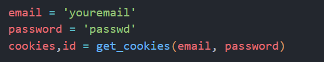
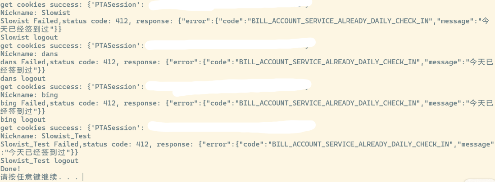

# pintia 自动签到脚本
> 目前仅限windows使用

- 预装条件：`python`

## 简明步骤
1. 手动修改脚本中的'your email'和'your password'，即pintia登陆的账号密码,在主程序如图所示位置：

2. 用记事本打开`automaticsignin.bat`,修改其中脚本地址为真实地址
3. 打开windows的Task Scheduler（任务执行程序）
- 选择“创建任务”，“操作”选项卡选择“新建”，程序或脚本选择`automaticsignin.bat`
- 触发器选项卡，选择新建，可以选择定时的时间

回到总界面，右侧选项卡中运行，可以测试是否设置成功.(或双击`.bat`文件试运行)

运行效果：（我一口气签了四个账号...）
